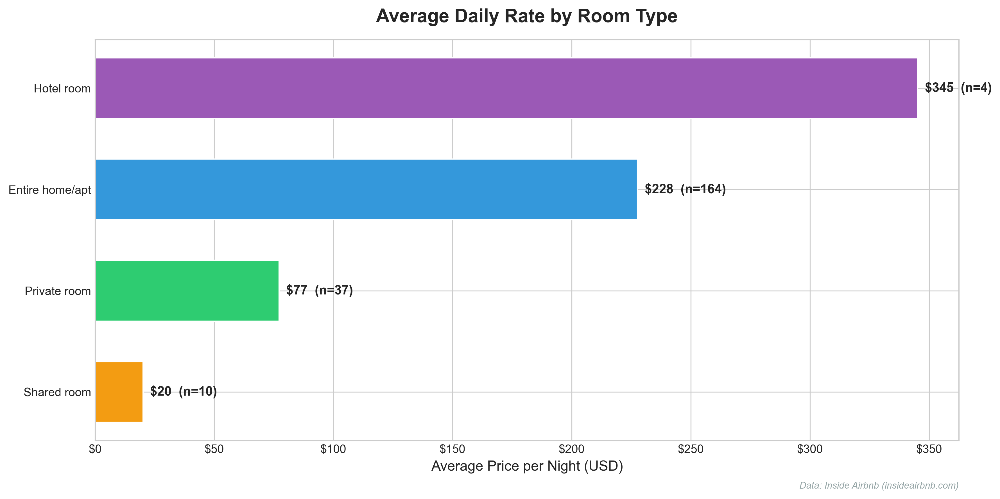
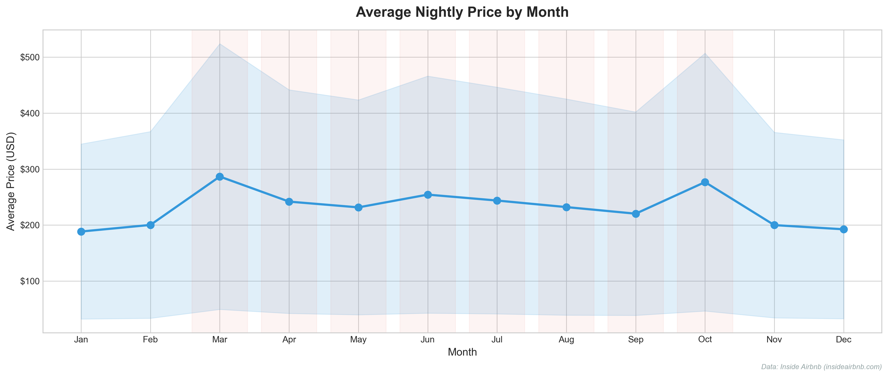
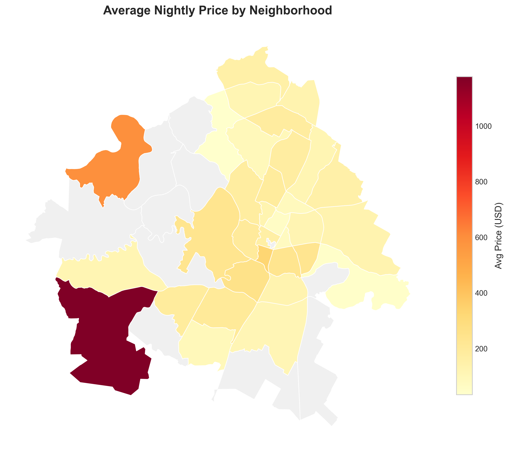
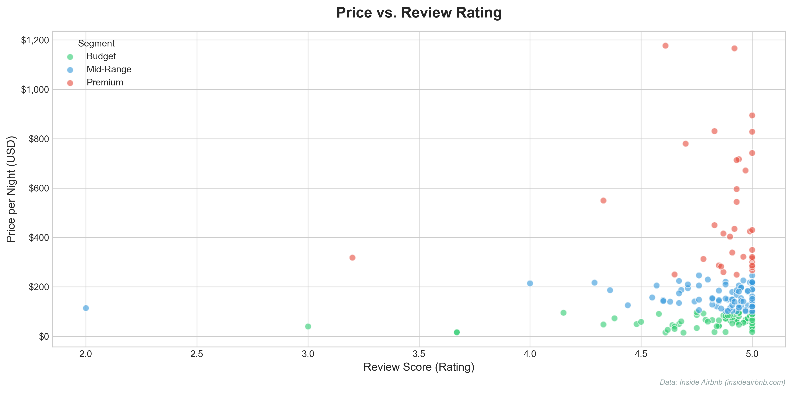
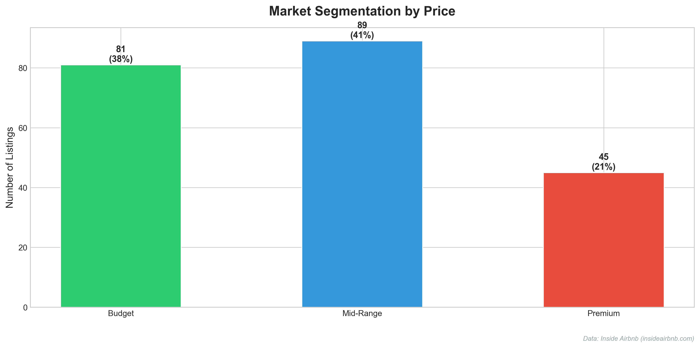

# Airbnb Market Analyzer

> Professional market analysis toolkit for short-term rental (STR) data intelligence

[](LICENSE)
[](https://www.python.org/)
[](http://insideairbnb.com/)

---

## Overview

A complete market analysis pipeline for Airbnb short-term rentals. Takes raw public data from [Inside Airbnb](http://insideairbnb.com/) and transforms it into actionable insights through automated data cleaning, statistical analysis, and professional visualizations.

**Demo city: Austin, TX** — easily configurable for any city available on Inside Airbnb.

This project demonstrates the kind of analysis that helps investors, property managers, and real estate agents make data-driven decisions in the STR market.

---

## Screenshots

### Average Daily Rate by Room Type


### Price Seasonality (Monthly Trends)


### Neighborhood Price Heatmap


### Price vs. Rating — Competitive Landscape


### Market Segmentation


---

## Quick Start

### Prerequisites

- Python 3.10+
- pip

### Installation

```bash
# Clone the repository
git clone https://github.com/yourusername/airbnb-market-analyzer.git
cd airbnb-market-analyzer

# Create virtual environment
python -m venv .venv
source .venv/bin/activate  # Windows: .venv\Scripts\activate

# Install dependencies
pip install -r requirements.txt
```

### Run the Analysis

```bash
# Option 1: Use included sample data (works out-of-the-box)
jupyter notebook notebooks/

# Option 2: Download full dataset for Austin, TX
python -c "from src.data_loader import download_all_data; download_all_data()"
```

Open the notebooks in order:
1. `01_data_exploration.ipynb` — Data structure and quality assessment
2. `02_market_overview.ipynb` — Pricing, supply, and market concentration
3. `03_seasonality.ipynb` — Temporal patterns and seasonal premiums
4. `04_neighborhood_analysis.ipynb` — Geographic segmentation and heatmaps
5. `05_competitive_landscape.ipynb` — Market positioning and gap analysis

---

## Project Structure

```
airbnb-market-analyzer/
├── config/
│   └── settings.yaml              # Centralized configuration (city, thresholds, styles)
├── data/
│   ├── raw/                        # Full datasets (not in git — download via data_loader)
│   └── sample/                     # Curated sample data (included, works out-of-the-box)
├── notebooks/
│   ├── 01_data_exploration.ipynb
│   ├── 02_market_overview.ipynb
│   ├── 03_seasonality.ipynb
│   ├── 04_neighborhood_analysis.ipynb
│   └── 05_competitive_landscape.ipynb
├── src/
│   ├── data_loader.py              # Auto-download and load Inside Airbnb data
│   ├── data_cleaner.py             # Price normalization, outlier filtering, imputation
│   ├── analyzers/
│   │   ├── market_overview.py      # ADR, supply, concentration, ratings
│   │   ├── seasonality.py          # Monthly trends, peak seasons, weekend premiums
│   │   ├── neighborhood.py         # Geographic segmentation, heatmaps, saturation
│   │   └── competitive.py          # Segmentation, amenities, superhosts, gaps
│   └── visualizations/
│       └── charts.py               # Professional chart generation (matplotlib/seaborn)
├── outputs/
│   └── charts/                     # Exported high-resolution charts (300 DPI)
├── screenshots/                    # Key visuals for this README
├── requirements.txt
├── LICENSE
└── README.md
```

---

## Data Source

**[Inside Airbnb](http://insideairbnb.com/get-the-data/)** — publicly available datasets under Creative Commons CC0 1.0 license.

| File | Description | Size (Austin) |
|------|-------------|---------------|
| `listings.csv.gz` | Detailed listing attributes (75+ columns) | ~10,000 rows |
| `calendar.csv.gz` | Daily availability and pricing (365 days) | ~3.8M rows |
| `reviews.csv.gz` | Guest reviews with timestamps | ~588K rows |
| `neighbourhoods.geojson` | Neighborhood boundary polygons | 50+ neighborhoods |

The data loader auto-detects the latest available dataset for any supported city.

---

## Methodology

### Data Cleaning
- **Price normalization:** Convert `$1,234.56` strings to numeric values
- **Outlier filtering:** Remove listings with prices outside $10–$2,000/night
- **Activity filtering:** Keep only listings with recent reviews or availability
- **Missing values:** Impute bedrooms/beds with median by room type; drop rows missing critical fields
- **Calculated fields:** Price per person, estimated monthly revenue, review recency

### Key Metrics
| Metric | Definition |
|--------|-----------|
| **ADR** (Average Daily Rate) | Mean nightly price across active listings |
| **Occupancy Rate** | Estimated from calendar: `1 - availability_rate` |
| **HHI** (Market Concentration) | Herfindahl–Hirschman Index based on host listing shares |
| **Seasonal Premium** | Price difference between high and low season months |
| **Weekend Premium** | Price difference between Fri–Sat and Mon–Thu |

### Analysis Modules
1. **Market Overview** — Supply composition, pricing distributions, host concentration, rating analysis
2. **Seasonality** — Monthly price trends, occupancy patterns, SXSW/ACL event impact, day-of-week pricing
3. **Neighborhood** — ADR by area, listing density, saturation scores, choropleth mapping
4. **Competitive** — Price-tier segmentation, price-vs-quality analysis, amenity differentiation, market gaps

---

## Configuration

Edit `config/settings.yaml` to analyze a different city:

```yaml
location:
  city: "nashville"       # Change city
  state: "tn"             # Change state
  country: "united-states"

cleaning:
  price:
    min: 10               # Adjust price bounds
    max: 2000

analysis:
  segments:               # Adjust price segments
    budget:
      min: 0
      max: 100
    mid_range:
      min: 100
      max: 250
    premium:
      min: 250
      max: 999999
```

---

## Business Applications

This analysis framework supports:

- **Investment decisions** — Market sizing, revenue projections, neighborhood selection
- **Competitive intelligence** — Pricing benchmarks, positioning, differentiation
- **Dynamic pricing** — Seasonal adjustments, event-based premiums, day-of-week optimization
- **Portfolio optimization** — Amenity prioritization, superhost ROI, gap identification

---

## Limitations & Disclaimer

- Data represents **listings**, not confirmed bookings or actual revenue
- Availability is a **proxy** for occupancy — actual bookings are unknown
- Inside Airbnb data is scraped periodically and may contain gaps
- This project is for **educational and research purposes only**
- Not affiliated with Airbnb, Inc.

---

## License

[MIT License](LICENSE)

---

## Acknowledgments

- Data: [Inside Airbnb](http://insideairbnb.com/) (Creative Commons CC0 1.0)
- Built with: Python, pandas, matplotlib, seaborn, geopandas, Jupyter
